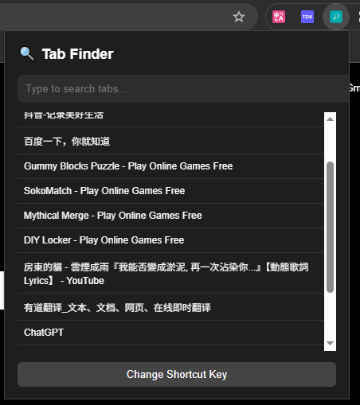

# 🔍 Tab Finder – A Fast Tab Switcher for Chrome

**Tab Finder** is a lightweight Chrome extension that helps you quickly search, locate, and switch between your open tabs — perfect for tab power users and multitaskers.

 

---

## ✨ Features

- 🔎 **Instant Search**: Search tabs by title or URL in real time.
- ⚡ **Keyboard Shortcut**: Open the search popup instantly with `Alt + Shift + K` (customizable).
- 🌙 **Dark Mode**: Sleek, modern UI designed for focus and comfort.
- 🧭 **One-Click Switch**: Click a result to instantly activate and focus the corresponding tab.
- 🧠 **Lightweight**: Runs fast even with hundreds of tabs open.
- 🛠️ **Open Source**: Transparent code and easy to modify or contribute.

---

## ⌨️ How to Use

1. Click the Tab Finder icon in your Chrome toolbar — or press `Alt + Shift + K`.
2. Start typing a keyword — matches will appear instantly.
3. Click a result or press `Enter` to jump to the tab.

> Tip: You can change the shortcut key at  
> `chrome://extensions/shortcuts`

---

## 🧪 Installation

### 🛠 From Source (for Developers):

1. Clone this repo:
   ```bash
   git clone https://github.com/yang-shuohao/tab-finder.git
   cd tab-finder

## 💰 Support This Project

If you find this project helpful, consider sponsoring or treating me a coffee ☕:

### 🧧 Donate via Chinese Payment (国内用户可扫码打赏)

<p align="center">
  
  
</p>

### 🌍 International Support

- [💸 Donate via PayPal](https://paypal.me/yangshuohao?country.x=C2&locale.x=zh_XC)

> Thank you for your support!